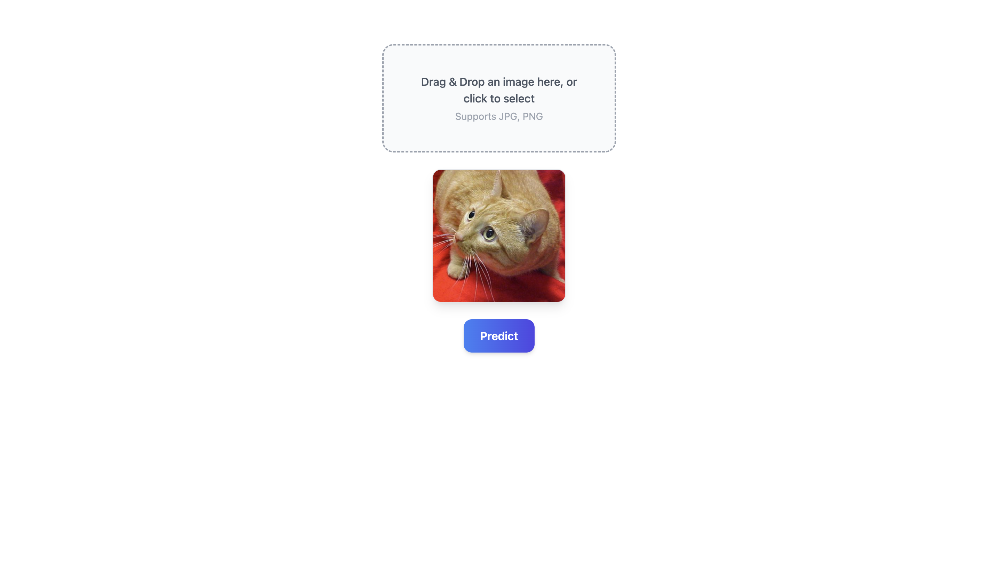
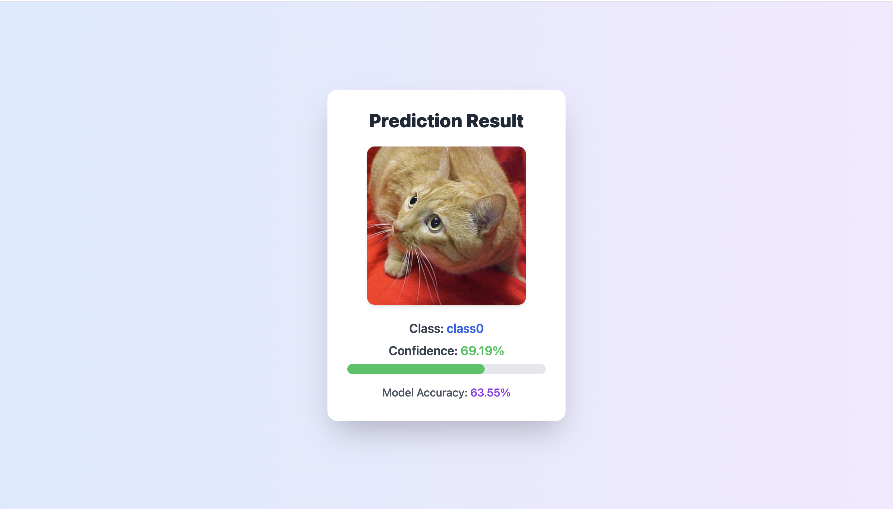
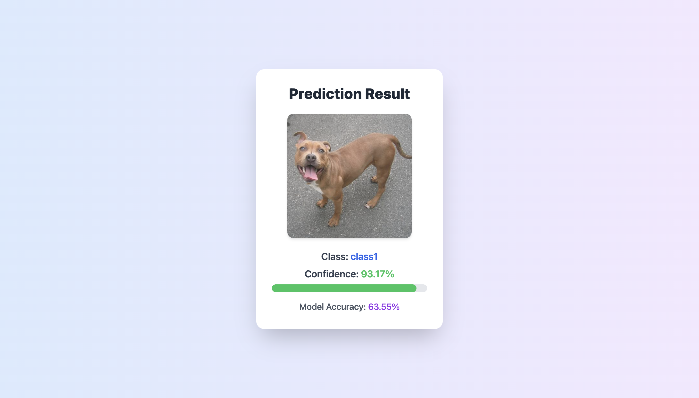

dataset link = https://www.kaggle.com/datasets/bhavikjikadara/dog-and-cat-classification-dataset

MLP-Mixer for Image Classification

      This project implements the MLP-Mixer architecture for vision tasks using PyTorch.  
      It allows training and inference on custom image datasets and demonstrates a modern alternative to convolutional neural networks (CNNs) using only MLP layers.

 Features
 
      Train MLP-Mixer on image datasets
      Save and load trained models (`.pth` files)
      Predict classes for new images
      Fully modular Python backend
      Example frontend for image uploads (React + PostCSS)

 Project Structure
 
          backend  : PyTorch model, training scripts, and dataset handling
          frontend : React-based UI for image uploads and predictions
          dataset : Folder for sample image data (split data train 80% and test 20% by using utils.py)

 Notes
        Large datasets and trained models may need to be downloaded separately. using given link you can download pet dataset which i also used it include Cats and Dogs                    Classification Dataset
      

